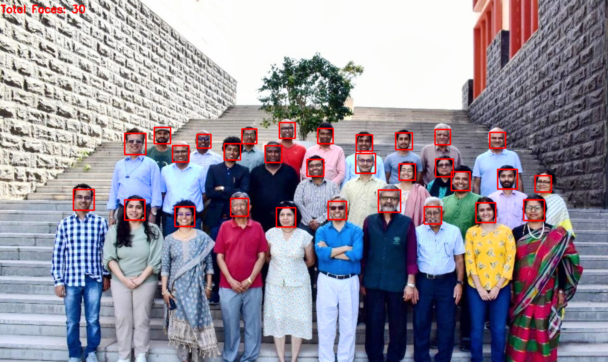
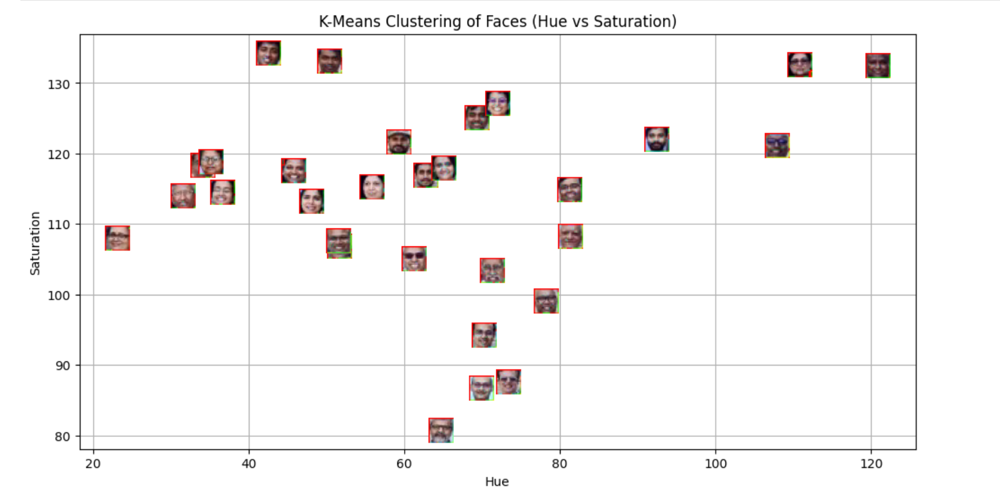
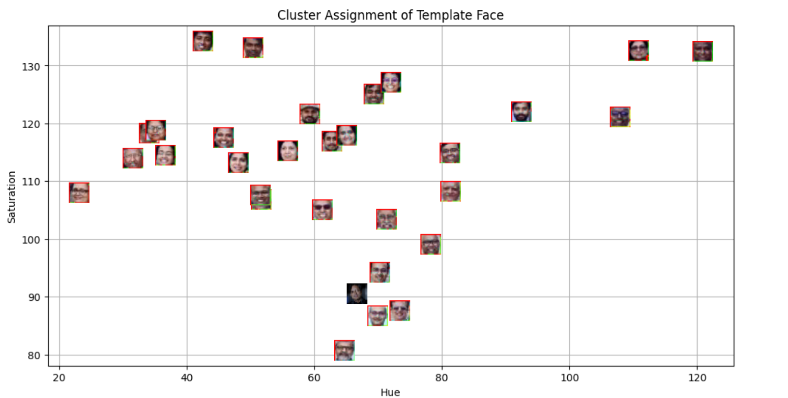

# MLPR_Lab5_Aadiarora
This project tried to first detect and then classify faces based on the values of hue and saturation. We used k-means clustering to group similar faces together. We then introduced a template/ test face to see how well our model performs. 

The Methodology:
1) Faces are detected using OpenCV’s Haar Cascade classifier: 
2) Features are then extracted from the images. they are the hue and saturation values of the faces. 
3) Then K_means clustering is applied to the faces. 
4) We then add a template image and repeat the same process on it. We then plot its K_means cluster location: 

Key Findings:
Faces cluster distinctly in HSV space.
Hue and Saturation are effective low-dimensional features for grouping similar faces.
K-Means successfully separates face regions into meaningful clusters.
The template image is correctly assigned to the cluster whose centroid is closest in feature space.
Visualization confirms that clustering corresponds to perceptual similarity.

